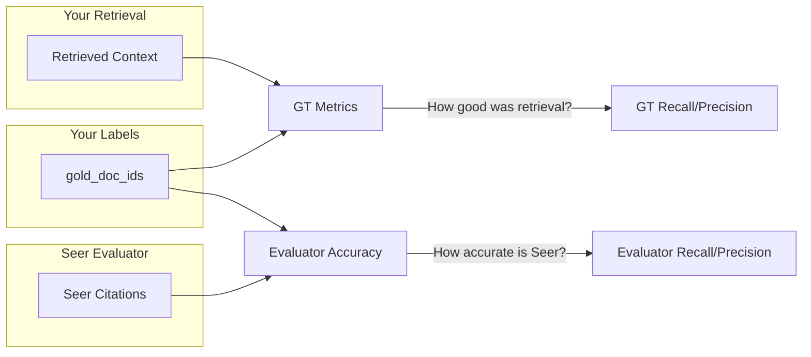

# Accuracy Testing

Measure how well Seer's evaluator performs on your domain by providing ground truth data.

## Overview

Seer's evaluator computes Recall, Precision, and F1 without labeled data. But you can validate that the evaluator is accurate for your domain by providing ground truth labels and comparing results.

### Why Test Seer's Accuracy?

- **Domain validation**: Confirm Seer works well with your content type (legal docs, code, medical, etc.)
- **Trust calibration**: Understand when to trust Seer's judgments
- **Debugging**: Identify categories of queries where Seer underperforms

---

## How It Works

When you provide `ground_truth` with `gold_doc_ids`, Seer computes two separate sets of metrics:



---

## Two Categories of Metrics

### 1. Ground Truth (GT) Metrics: Retrieval Quality

"How well did your retrieval system perform?"

These compare your retrieved context against gold labels:

| Metric | Formula | Description |
|--------|---------|-------------|
| **GT Recall** | `gold docs in context / total gold docs` | What % of relevant docs did you retrieve? |
| **GT Precision** | `gold docs in context / total docs in context` | What % of retrieved docs are relevant? |
| **GT F1** | Harmonic mean of GT Recall & Precision | Balanced retrieval quality score |

### 2. Evaluator Accuracy Metrics: Seer's Performance

"How accurately does Seer identify relevant passages?"

These compare Seer's citations against gold labels in context:

| Metric | Formula | Description |
|--------|---------|-------------|
| **Evaluator Precision** | `gold passages Seer cited / total passages Seer cited` | What % of Seer's citations are correct? |
| **Evaluator Recall** | `gold passages Seer cited / gold passages in context` | What % of gold docs did Seer correctly identify? |
| **Evaluator F1** | Harmonic mean | Balanced accuracy score |
| **Evaluator Exact Match** | `Seer citations == gold set` | Did Seer cite exactly the right passages? |

<Info title="Important Distinction">
- **GT Metrics** tell you about your **retrieval system** (did you fetch the right docs?)
- **Evaluator Metrics** tell you about **Seer's accuracy** (did Seer correctly identify them?)
</Info>

---

## Providing Ground Truth

Include the `ground_truth` parameter when logging. The `gold_doc_ids` field contains document IDs that match against the `id` field of your passages:

<Tabs>
  <Tab title="Python">
    ```python
    from seer import SeerClient

    client = SeerClient()

    client.log(
        task="What is the capital of France?",
        context=[
            {"text": "Paris is the capital of France.", "id": "doc-paris", "score": 0.95},
            {"text": "France is in Western Europe.", "id": "doc-france-geo", "score": 0.82},
            {"text": "The Eiffel Tower is in Paris.", "id": "doc-eiffel", "score": 0.78},
        ],
        ground_truth={
            # Document IDs that are relevant (matched against passage.id)
            "gold_doc_ids": ["doc-paris"],

            # Expected answer (optional)
            "answer": "Paris",
        },
    )
    ```
  </Tab>

  <Tab title="TypeScript">
    ```typescript
    import { SeerClient } from '@seer/sdk';

    const client = new SeerClient();

    client.log({
        task: "What is the capital of France?",
        context: [
            { text: "Paris is the capital of France.", id: "doc-paris", score: 0.95 },
            { text: "France is in Western Europe.", id: "doc-france-geo", score: 0.82 },
            { text: "The Eiffel Tower is in Paris.", id: "doc-eiffel", score: 0.78 },
        ],
        ground_truth: {
            // Document IDs that are relevant (matched against passage.id)
            gold_doc_ids: ["doc-paris"],

            // Expected answer (optional)
            answer: "Paris",
        },
    });
    ```
  </Tab>
</Tabs>

---

## Ground Truth Schema

```python
{
    "gold_doc_ids": list[str],    # Document IDs that are relevant
    "answer": str,                 # Expected answer text (optional)
}
```

### How Matching Works

Seer matches each ID in `gold_doc_ids` against the `id` field of passages in your context:

| Context Passage | `id` | In `gold_doc_ids`? | Your Label |
|-----------------|------|---------------------|------------|
| "Paris is the capital..." | `"doc-paris"` | Yes | Relevant |
| "France is in Western Europe..." | `"doc-france-geo"` | No | Not relevant |
| "The Eiffel Tower..." | `"doc-eiffel"` | No | Not relevant |

---

## What You See in the Dashboard

When ground truth is provided, the Seer dashboard shows:

### Retrieval Quality (GT Metrics)
- **Avg GT Recall**: Across all queries, what % of gold docs were retrieved
- **Avg GT Precision**: What % of retrieved docs were gold

### Evaluator Accuracy
- **Avg Evaluator Precision**: How often Seer's citations are correct
- **Avg Evaluator Recall**: How often Seer finds the gold passages
- **Avg Evaluator F1**: Balanced accuracy score
- **Exact Match Rate**: % of queries where Seer cited exactly the gold set

---

## Interpreting Results

### High Evaluator Accuracy (>90%)
Seer's judgments align well with your domain. Trust the metrics for production monitoring.

### Moderate Accuracy (70-90%)
Review disagreements. Common causes:
- **Seer finds implicit relevance**: The passage supports the answer indirectly
- **Your labels are incomplete**: Seer caught relevant passages you missed
- **Domain terminology**: Unusual jargon that Seer doesn't recognize

### Low Accuracy (&lt;70%)
Consider:
- Is your ground truth comprehensive?
- Does your domain have highly specialized terminology?
- Are your passages very long or complex?

<Tip title="Custom Evaluators">
If Seer doesn't perform well on your domain, contact us at ben@seersearch.com. We can work with you to create specialized evaluator models tuned for your specific content type (legal, medical, code, etc.).
</Tip>

---

## Example: Complete Workflow

```python
client.log(
    task="What is machine learning and who coined the term?",
    context=[
        {"text": "ML is a subset of AI that learns from data.", "id": "doc-ml-intro"},
        {"text": "The weather is nice today.", "id": "doc-weather"},  # irrelevant
        {"text": "Arthur Samuel coined the term ML in 1959.", "id": "doc-ml-history"},
        {"text": "Python is a programming language.", "id": "doc-python"},  # irrelevant
    ],
    ground_truth={
        # These document IDs match the `id` field of relevant passages
        "gold_doc_ids": ["doc-ml-intro", "doc-ml-history"],
    },
)
```

**Scenario 1: Seer cites `doc-ml-intro` and `doc-ml-history` (perfect match):**
- GT Recall = 2/2 = 100% (both gold docs were retrieved)
- GT Precision = 2/4 = 50% (half the retrieved docs are gold)
- Evaluator Recall = 2/2 = 100% (Seer found both gold docs)
- Evaluator Precision = 2/2 = 100% (all Seer citations are gold)
- Evaluator Exact Match = Yes

**Scenario 2: Seer cites `doc-ml-intro` and `doc-weather` (false positive):**
- GT Recall = 2/2 = 100%
- GT Precision = 2/4 = 50%
- Evaluator Recall = 1/2 = 50% (Seer only found one gold doc)
- Evaluator Precision = 1/2 = 50% (half of Seer's citations are wrong)
- Evaluator Exact Match = No

---

## Batch Evaluation

For systematic accuracy testing, replay a labeled dataset:

### Dataset Format (JSONL)

```json
{"task": "What is ML?", "context": [{"text": "ML is AI...", "id": "doc1"}], "ground_truth": {"gold_doc_ids": ["doc1"]}}
{"task": "Who invented Python?", "context": [{"text": "Guido van Rossum...", "id": "doc2"}], "ground_truth": {"gold_doc_ids": ["doc2"]}}
```

### Replay Script

```python
import json
from seer import SeerClient

client = SeerClient()

with open("test_dataset.jsonl") as f:
    for line in f:
        example = json.loads(line)
        client.log(
            task=example["task"],
            context=example["context"],
            ground_truth=example["ground_truth"],
            metadata={"dataset": "accuracy-test-v1"},
            sample_rate=1.0,  # Evaluate all examples
        )
```

---

## Best Practices

1. Use consistent passage IDs. The `id` field must match exactly between passages and `gold_doc_ids`.
2. Start small. Test with 50-100 labeled examples first.
3. Cover edge cases. Include hard queries where context is borderline.
4. Review disagreements. Sometimes the evaluator is right and labels are incomplete.
5. Set `sample_rate=1.0` to ensure all test examples are evaluated.

---

## See Also

- [Metrics](/metrics) — Understand what Seer computes
- [Context & Event Schema](/context-and-event-schema) — Full payload format
- [Python SDK](/sdk-python) | [TypeScript SDK](/sdk-typescript) — SDK reference
