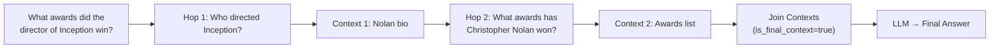

# Multi-Hop & Agentic Retrieval

Seer supports logging and evaluating multi-step retrieval workflows, from decomposed queries to agentic RAG patterns.

## Overview

Many real-world queries can't be answered with a single retrieval. Consider:

> **"What awards did the director of Inception win?"**

This requires:
1. First, find who directed Inception → Christopher Nolan
2. Then, find what awards Christopher Nolan won

Seer tracks each hop separately while computing trace-level metrics from the final context.



---

## Key Fields

### `task`: The Original Query

Always pass the original user query in `task`. This is what Seer evaluates against for end-to-end relevance.

### `subquery`: The Decomposed Question

The `subquery` is what this specific retrieval hop is trying to answer. A query rewriter or planner typically generates these.

### `is_final_context`: Final Evidence for the LLM

Mark the retrieval step whose context is passed to the LLM or agent for final answer synthesis. Seer uses this span for trace-level metrics.

---

## Complete Example: Query Decomposition

```python
from seer import SeerClient
from opentelemetry import trace

client = SeerClient()
tracer = trace.get_tracer(__name__)

def answer_multi_hop_question(query: str) -> str:
    """
    Example: "What awards did the director of Inception win?"

    This requires decomposing into:
    1. "Who directed Inception?"
    2. "What awards has [director] won?"
    """
    with tracer.start_as_current_span("multi_hop_query"):

        # Hop 1: Find the director
        # A query rewriter rewrites the original question to get the first piece
        subquery1 = "Who directed Inception?"

        with tracer.start_as_current_span("retrieval_hop_1"):
            hop1_context = retrieve(subquery1)

            client.log(
                task=query,                      # Original: "What awards did..."
                context=hop1_context,
                subquery=subquery1,              # "Who directed Inception?"
                span_name="retrieval_hop_1",
            )

            # Extract the answer: "Christopher Nolan"
            director = extract_entity(hop1_context, "director")

        # Hop 2: Find awards for the director
        # Query rewriter uses extracted entity to form the next subquery
        subquery2 = f"What awards has {director} won?"

        with tracer.start_as_current_span("retrieval_hop_2"):
            hop2_context = retrieve(subquery2)

            client.log(
                task=query,                      # Still the original query
                context=hop2_context,
                subquery=subquery2,              # "What awards has Christopher Nolan won?"
                span_name="retrieval_hop_2",
            )

        # Combine contexts from all hops
        all_context = hop1_context + hop2_context

        # Log the final joined context that goes to the LLM
        with tracer.start_as_current_span("context_join"):
            client.log(
                task=query,
                context=all_context,             # Combined context from all hops
                span_name="final_context",
                is_final_context=True,           # THIS is what the LLM sees
            )

        return synthesize_answer(query, all_context)
```

---

## What Seer Evaluates

For each hop, Seer computes:

| Evaluation | Against | Purpose |
|------------|---------|---------|
| **Task Recall** | Original `task` | Is this hop contributing to the end goal? |
| **Subquery Recall** | `subquery` | Did this hop answer its specific question? |

### Example Metrics

| Span | Subquery | Subquery Recall | Task Recall |
|------|----------|-----------------|-------------|
| Hop 1 | "Who directed Inception?" | 100% (found Nolan) | 50% (partial answer) |
| Hop 2 | "What awards has Nolan won?" | 100% (found awards) | 80% (most of answer) |
| **Final Context** | — | — | **100%** (complete) |

Trace-level metrics are computed from the `is_final_context=True` span (the joined context).

---

## Trace-Level vs Span-Level Metrics

| Metric Level | Scope | Use Case |
|--------------|-------|----------|
| **Span-level** | Individual retrieval step | Debug which hop failed |
| **Trace-level** | Final context | End-to-end quality for the user |

### Trace-Based Sampling

When you provide a `trace_id` (auto-detected from OTEL), Seer ensures all spans in the trace get the same sampling decision. You'll never see partial traces.

---

## Agentic RAG Patterns

For agent loops where the number of retrievals is dynamic:

```python
def agent_loop(query: str, max_iterations: int = 5):
    """Agent decides when to retrieve and when to answer."""
    context_so_far = []

    with tracer.start_as_current_span("agent_query"):
        for i in range(max_iterations):
            # Agent decides next action
            action = agent.plan_next_action(query, context_so_far)

            if action.type == "retrieve":
                # Agent wants more information
                results = retrieve(action.search_query)
                context_so_far.extend(results)

                client.log(
                    task=query,
                    context=results,
                    subquery=action.search_query,  # What the agent searched for
                    span_name=f"agent_retrieval_{i}",
                    metadata={
                        "iteration": i,
                        "agent_reasoning": action.reasoning,
                    },
                )

            elif action.type == "answer":
                # Agent is ready to synthesize
                # Mark the final context
                client.log(
                    task=query,
                    context=context_so_far,
                    span_name="final_context",
                    is_final_context=True,
                )
                break

        return agent.synthesize(query, context_so_far)
```

---

## More Examples

### Parallel Retrieval

When you search multiple sources in parallel:

```python
with tracer.start_as_current_span("parallel_retrieval"):
    # Search multiple sources simultaneously
    wiki_results = retrieve_from_wiki(query)
    kb_results = retrieve_from_kb(query)

    client.log(task=query, context=wiki_results, span_name="retrieval_wiki")
    client.log(task=query, context=kb_results, span_name="retrieval_kb")

    # Combine and pass to LLM
    combined = wiki_results + kb_results
    client.log(
        task=query,
        context=combined,
        span_name="final_merged",
        is_final_context=True,
    )
```

### Iterative Refinement

When you re-retrieve based on LLM feedback:

```python
# Initial retrieval
initial_context = retrieve(query)
client.log(task=query, context=initial_context, span_name="retrieval_initial")

# LLM suggests refinement
refined_query = llm.suggest_refined_query(query, initial_context)

# Refined retrieval
refined_context = retrieve(refined_query)
client.log(
    task=query,
    context=refined_context,
    subquery=refined_query,
    span_name="retrieval_refined",
    is_final_context=True,
)
```

---

## Best Practices

### 1. Always Set `is_final_context` for the Last Hop

This enables trace-level metrics that reflect end-user experience:

```python
# The context that actually goes to the LLM
client.log(..., is_final_context=True)
```

### 2. Keep `task` Consistent Across Hops

The original query should stay the same. That's what you're ultimately trying to answer:

```python
# Correct: Same task, different subqueries
client.log(task=original_query, subquery="Who is X?", ...)
client.log(task=original_query, subquery="What did X do?", ...)

# Wrong: Changing task per hop
client.log(task="Who is X?", ...)  # Don't do this
```

### 3. Use Subqueries for Decomposition

Subqueries help diagnose which step failed:

```python
# If task recall is low but subquery recall is high,
# the problem is query decomposition, not retrieval
```

### 4. Use Consistent Span Names

| Pattern | Span Name |
|---------|-----------|
| Sequential hops | `retrieval_hop_1`, `retrieval_hop_2` |
| Parallel sources | `retrieval_wiki`, `retrieval_kb` |
| Agent iterations | `agent_retrieval_0`, `agent_retrieval_1` |
| Final merged | `final_context` |

---

## See Also

- [Context & Event Schema](/context-and-event-schema)
- [Python SDK](/sdk-python) | [TypeScript SDK](/sdk-typescript)
- [Metrics](/metrics)
- [Logs Explorer](/logs)
