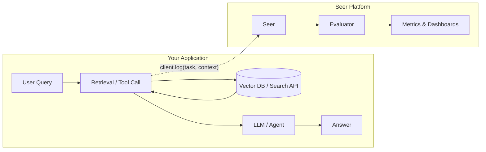

Seer is a retrieval evaluation and monitoring platform that helps teams keep RAG/context pipelines accurate, auditable, and fast, without labeled data.

Why this matters: wrong or missing context is the #1 source of bad AI answers. Seer continuously measures retrieval quality from unlabeled live traffic, so you can test changes faster, ship them confidently, and catch regressions early.

---

## What Seer Does

- **Log retrieval events** from your app using a lightweight SDK
- **Compute metrics automatically** from unlabeled inputs:
  - **Recall:** Our model enumerates the minimal requirements needed to answer a question and checks which are supported by the retrieved context. `recall = covered_requirements / total_requirements`
  - **Precision:** what proportion of retrieved documents in context are useful to answer the question/task. `relevant_docs / total_docs`
  - **F1, nDCG:** Derived from recall and precision
- **Compare variants** using `feature_flag` in metadata for A/B testing
- **Monitor production** with configurable sampling and real-time dashboards

---

## How Seer Fits Your Stack

| Tool Type | Example | Seer's Role |
|-----------|---------|-------------|
| **Tracing** | LangSmith, Arize | Seer focuses on **retrieval quality signals**, not full trace introspection. Use both together. Seer is OTEL-compatible and automatically picks up trace context. |
| **Core Search Infra** | Pinecone, Weaviate, Exa | These handle search. Seer evaluates **whether the results were sufficient** and helps evaluate and tune search infra for your product's specific needs. |
| **Observability** | Datadog, Grafana | Seer provides **domain-specific retrieval metrics** that complement general APM. |

---

## Where Seer Fits In Your App



Seer integrates as a **lightweight sidecar** to your retrieval step:
1. Your app retrieves context from vector DBs, search APIs, or agent tools
2. After retrieval, call `client.log()` with the query and results
3. Seer evaluates quality asynchronously, with no impact on latency

---

## Quick Example

```python
from seer import SeerClient

client = SeerClient()  # reads SEER_API_KEY from env

# Your retrieval step (vector DB, search API, agent tool, etc.)
def retrieve(query: str) -> list[dict]:
    return [
        {"text": "Christopher Nolan directed Inception.", "score": 0.95},
        {"text": "Nolan is British-American.", "score": 0.89},
    ]

query = "Who directed Inception and what is their nationality?"
context = retrieve(query)

client.log(
    task=query,
    context=context,
    metadata={
        "env": "prod",
        "feature_flag": "retrieval-v1",  # for A/B testing
    },
)
# Events are sent automatically in the background (fire-and-forget mode)
```

<Tip title="Auto-flush">
The SDK auto-flushes pending events when your process exits normally. You only need to call `client.flush()` explicitly if using `os._exit()`, process pools, or short-lived scripts.
</Tip>

---

## Key Concepts

### Task
The user query or question that triggered the retrieval.

### Context
The list of passages/documents returned by your retriever. Can be simple strings or objects with metadata.

### Metadata
Free-form key-value dict for filtering. Common fields:
- `env`: environment (prod, staging, dev)
- `feature_flag`: A/B test variant

### Recall
The fraction of requirements needed to answer the query that are covered by the context. `recall = 1.0` means the context is complete.

### Precision
The fraction of context passages that actually contribute to the answer. Low precision = context bloat.

---

## Multi-Hop & Agentic Retrieval

For multi-step retrieval (decomposed queries, agent loops), Seer supports:

- `is_final_context`: mark which retrieval step provides the final evidence for the answer
- `subquery`: track decomposed sub-questions for per-hop evaluation
- Trace linking: automatic OTEL trace context to group related retrievals

```python
# Example: Multi-hop retrieval
client.log(
    task="What awards did the director of Inception win?",
    context=hop2_results,
    subquery="What awards did Christopher Nolan win?",  # this hop's goal
    is_final_context=True,  # final evidence for the answer
)
```

**[Learn more → Multi-Hop Retrieval Guide](/multi-hop-retrieval)**

---

## Use Cases

| Use Case | How Seer Helps |
|----------|----------------|
| **Change Testing** | Compare retrieval variants (top k, rerankers, hybrid) before shipping |
| **Production Monitoring** | Track recall/precision trends, catch drift early |
| **Citation Auditing** | Verify answers cite the right sources for compliance |
| **Index Gap Analysis** | Find information categories that need improvement in your knowledge bases |

---

## Getting Started

1. [Quickstart](/quickstart): Make your first log in 5 minutes
2. [Python SDK](/sdk-python) | [TypeScript SDK](/sdk-typescript)
3. [Metrics](/metrics): Understand what Seer computes
4. [Change Testing](/change-testing): A/B test retrieval changes
5. [Production Monitoring](/production-monitoring): Set up ongoing monitoring
